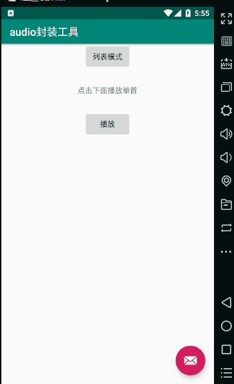

# AudioDemo
音频播放/列表音频播放

使用mediaplayer 进行封装的音乐播放工具

</img>

简书地址: https://www.jianshu.com/p/8315423c9246
 (2个工具类kotlin写的  其他页面也有用java  赶时间 有点混搭- -)

  如果用的网络url需要自己做缓存 或者先下载到本地  避免浪费流量

   用法:
复制util目录下的2个文件

       AudioUtil 关键的3个方法:
                            1.播放类型 初始化的时候设置
                           AudioUtil.Companion.getTYPE_RAW();  //raw路径,要转成String传递   比如 R.raw.justDoit +""
                           AudioUtil.Companion.getTYPE_ASSETS(); //assets路径 比如  "你听得到-周杰伦.mp3"
                           AudioUtil.Companion.getTYPE_URLorFILE();   //可以是文件或者网络url

        string path =  R.raw.hanguo+""

        1.初始化方法
            udioUtil = new AudioUtil(AudioUtil.Companion.getTYPE_RAW());//初始化 指定类型

        2.播放前的准备
            audioUtil.ready(activity(可改为fragment), 是否重复播放,path ,监听器)

        3.首次播放方法,进度和总时长都是秒.
            audioUtil.play(当前进度(没有则传0), 总时长(没有则传0), 播放监听);

   单独播放音乐示例:

         AudioUtil audioUtil;

         private void initMedia(Button bt) { //点击事件示例  传递的参数根据项目而定
               if (audioUtil == null) {
                    //1
                   audioUtil = new AudioUtil(AudioUtil.Companion.getTYPE_RAW());//初始化 指定类型
                   //2
                   audioUtil.ready(this, false, R.raw.hanguo + "", new AudioUtil.onReadyListener() {
                       @Override
                       public void isReady(int duration, @NotNull String chinese, @NotNull String durationTime) {

                           //3.初始化完成 可以选择直接播放
                           audioUtil.play(0, 0, isPlay -> {
                               if (isPlay)
                                   bt.setText("暂停");
                           });
                       }

                       @Override
                       public void onError() {
                           audioUtil.toastShort("播放出现异常");
                           bt.setText("播放");
                       }

                       @Override
                       public void onPlayOver() {
                           audioUtil.toastShort("播放结束");
                           bt.setText("播放");
                       }
                   });
               } else {
                   if (audioUtil.isPlaying()) {
                       bt.setText("播放");
                       audioUtil.pause();
                   } else {
                       bt.setText("暂停");
                       audioUtil.resume();
                   }
               }

           }

    列表播放示例:

    activity中:
             val url1 = "你听得到-周杰伦.mp3"
                val url2 = "韩国恐龙.mp3"

                val list = listOf(
                        AudioBean(1, url1, null, "60:60", "00:00"),
                        AudioBean(2, url2, null, "60:60", "00:00"),
                        AudioBean(3, url1, null, "60:60", "00:00"),
                        AudioBean(4, url2, null, "60:60", "00:00")
                )

                adapter = AdapterList(this, list)
                rcv_list.layoutManager = LinearLayoutManager(this)
                rcv_list.adapter = adapter

    适配器中:(用的java写的 可将整个类转为kotlin查看)
        AudioBean audioBean = data.get(position);//实体类

        //1.初始化 相关参数
        holder.time2.setText("/" + audioBean.getDuration());
        boolean inPlayInMe = Helper_PlayAudio.Companion.getMPlayingId() == audioBean.getId();//当前播放的是否是自己
        holder.setImage(inPlayInMe, mAudioUtil);

        holder.time1.setText(audioBean.getNowDuration());
        holder.seekbar.setProgress(audioBean.getNowDurationStamp() <= 0 ? 0 : audioBean.getNowDurationStamp() / audioBean.getDurationStamp() * 100);

        //给进度条做个标识的方法   避免影响其他的进度条  必须有标识
        holder.seekbar.setTag(audioBean.getId());

        //2.播放与暂停的回调
        AudioUtil.onPlayListener listener = isPlay -> {
            holder.setImage2(isPlay);
        };

        //3.点击事件
        holder.playView.setOnClickListener(v -> {

            //4.初始化并播放
            Helper_PlayAudio.Companion.toPlayer(
                    mAudioUtil,
                    mActivity,
                    audioBean,
                    true,
                    holder.playView, //播放暂停按钮
                    holder.bBview,  //播放动画 view 可不传也可自行修改
                    holder.time1,  //当前播放时间的textview
                    holder.time2, //显示总时长的textview
                    holder.seekbar, //进度条
                    listener  //播放与暂停的回调
            );

        });

          viewhoder中的方法 也可写在其他地方如adapter中  根据需要自己调整

         //根据当前播放是不是本条 再图标变换
          public void setImage(boolean isMe, AudioUtil util) {
                    playView.setImageResource(PAUSE_IMG);
                    if (isMe) {
                        setImage2(util.isPlaying());
                    } else
                        setImage2(false);

                }

                //单纯图标变换
                private void setImage2(boolean isplayig) {
                    if (isplayig) {
                        playView.setImageResource(PLAYING_IMG);
                        bBview.start(10);
                    } else {
                        playView.setImageResource(PAUSE_IMG);
                        bBview.stop();
                    }
                }

